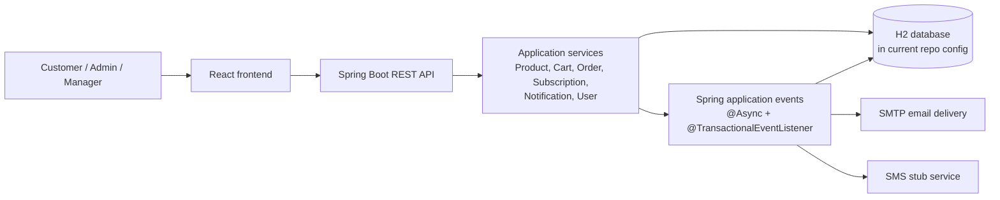

# Event-Driven E-Commerce Platform

Internal repository name: `online_store_swa`

A full-stack e-commerce application built to explore software architecture beyond a typical CRUD webshop: transactional backend workflows, in-process event-driven notifications, persistence design, role-aware APIs, and a broad automated test suite.

## What The Platform Does

The platform covers the core customer and administration workflows of an online store:

- browsing and filtering products,
- viewing product details and reviews,
- managing a persistent server-side cart,
- creating and paying for orders,
- tracking order history and order status,
- managing user profiles and addresses,
- administering products and users,
- subscribing to product changes and receiving notifications.

The storefront is only the domain context. The interesting part of the repository is the architecture around it: event publication on product changes and payment confirmation, asynchronous notification handling, domain-specific persistence rules, and test coverage around services, controllers, repositories, mappers, and listeners.

## Key Capabilities

- Spring Boot REST API for products, carts, orders, subscriptions, notifications, users, addresses, authentication, registration, reviews, and admin management.
- React/Vite frontend with public, authenticated, manager-only, and admin-only routes.
- Server-side cart management instead of a purely frontend cart state.
- Product filtering, sorting, pagination, and search.
- Subscription-based notifications for product changes such as name, description, price, discount, and restock updates.
- Payment flow that confirms orders and triggers post-payment notification handling.
- Soft deletion for products and users, with order history retained.

## System Architecture



## Event-Driven Workflows

This repository uses **in-process Spring application events**, not a separate broker such as Kafka or RabbitMQ.

The relevant characteristics visible in the code are:

- events are published from service-layer business logic through `ApplicationEventPublisher`,
- listeners run with `@TransactionalEventListener(phase = AFTER_COMMIT)`,
- delivery listeners are marked `@Async`,
- notification records are persisted before channel-specific delivery is attempted,
- notification status is updated to `SENT` or `FAILED` after delivery handling.

### Product Subscription Notifications

**Trigger -> event -> consumer -> result**

1. A manager or admin updates a product through `PUT /products/{id}`.
2. `ProductServiceImpl` compares old and new state and publishes one or more product events:
   - `ProductNameUpdateEvent`
   - `ProductDescriptionUpdateEvent`
   - `ProductPriceUpdateEvent`
   - `ProductDiscountUpdateEvent`
   - `ProductRestockEvent`
3. `SubscriptionNotificationListener` receives the event after the transaction commits.
4. It loads matching subscriptions for that product and subscription type.
5. For each subscribed user and enabled channel, it creates a persistent `Notification` entity and publishes a channel-specific event using `NotificationType.createEvent(...)`.
6. `EmailNotificationEventListener` or `SmsNotificationEventListener` handles the delivery asynchronously.
7. The delivery service updates the notification status to `SENT` or `FAILED`.

### Order Confirmation After Payment

**Trigger -> event -> consumer -> result**

1. The frontend posts a payment request to `POST /cart/payment`.
2. `PaymentController` validates the mock payment request and calls `OrderService.confirmPayment(...)` on success.
3. `OrderService` sets the order to `PAID`, stores a transaction ID, reloads the order with its items, and publishes `OrderCompletionEvent`.
4. `OrderCompletionEventListener` creates a persistent notification for the ordering user and publishes an `EmailNotificationEvent`.
5. `EmailNotificationEventListener` delegates to `EmailNotificationService`, which attempts SMTP delivery and marks the notification `SENT` or `FAILED`.

### Why This Architecture Matters

The event-driven behavior is not a buzzword layer on top of CRUD endpoints. It is used to decouple state-changing workflows from notification side effects:

- product updates do not directly deliver notifications inside the update handler,
- order confirmation does not directly send email inside the payment controller,
- delivery only starts after the underlying transaction has committed,
- notification persistence and delivery status become part of the domain model.

## Engineering Highlights

- **Server-side cart as system of record**  
  Problem: a frontend-owned cart is easy to manipulate and requires repeated backend reconciliation during checkout.  
  Implementation: the cart is modeled and persisted in the backend, with quantity, price, discount, and availability checks handled in service logic.  
  Why it matters: order creation can work from authoritative backend state instead of trusting client-assembled product data.

- **Transactional event publication after product changes**  
  Problem: subscribers should only be notified about product changes that were actually committed.  
  Implementation: product update logic publishes typed Spring events, and listeners consume them with `@TransactionalEventListener(phase = AFTER_COMMIT)`.  
  Why it matters: notification fan-out is decoupled from the request path without observing uncommitted state.

- **Persisted notification audit trail**  
  Problem: asynchronous delivery side effects need visible state, not just fire-and-forget behavior.  
  Implementation: notifications are stored with channel and status (`QUEUED`, `SENT`, `FAILED`) before delivery services run.  
  Why it matters: the application exposes notification history through its own API and can represent delivery outcomes explicitly.

- **Order workflow split across synchronous and asynchronous steps**  
  Problem: payment confirmation should update order state immediately, while email confirmation remains a side effect.  
  Implementation: payment confirmation persists the order update synchronously, then publishes `OrderCompletionEvent` for post-commit notification handling.  
  Why it matters: the checkout flow keeps its transactional core separate from communication concerns.

- **Role-aware API and UI boundaries**  
  Problem: product administration, user administration, and customer workflows should not share the same access model.  
  Implementation: the backend uses JWT-based authentication and role checks, while the frontend mirrors that with authenticated, manager-only, and admin-only routes.  
  Why it matters: the repository demonstrates coordinated frontend/backend authorization boundaries rather than only endpoint scaffolding.

- **Broad automated test coverage across layers**  
  Problem: architectural code such as listeners, services, and filtered endpoints is easy to regress.  
  Implementation: the repository contains controller tests, service tests, repository tests, mapper tests, listener tests, and event tests. Async behavior is made deterministic in tests through a synchronous executor override.  
  Why it matters: the tests target both business logic and architectural behavior, not just isolated utility functions.

## My Contribution

- Implemented and refined the backend event-driven notification architecture around product update events, subscription handling, channel-specific notification dispatch, and order-confirmation email flow.
- Implemented or improved product sorting, pagination, stock-handling behavior, and several order- and user-management backend workflows.
- Added and expanded automated tests for event/listener behavior, subscriptions, order-email composition, and related backend components.
- Contributed architecture documentation and project documentation, including UML and README updates used for the final project presentation.

## Technology Stack

| Layer | Technologies verified in the repository |
| --- | --- |
| Backend | Java 21, Spring Boot, Spring Security, Spring Data JPA, Spring Mail, Jakarta Validation |
| Event mechanism | Spring `ApplicationEventPublisher`, `@TransactionalEventListener`, `@Async` |
| Persistence | H2 in current repo configuration, JPA entities, Spring Data repositories |
| Frontend | React 18, TypeScript, Vite, React Router, Tailwind CSS, Axios |
| Quality tooling | JUnit, Mockito, Spring Boot test support, JaCoCo, ESLint, Prettier, Husky, Vitest setup |
| Packaging | Maven, npm, Docker multi-stage build, `docker-compose.prod.yml` |

## Testing And Quality Assurance

The backend has the strongest testing story in the repository.

- **Controller/API tests** use `@WebMvcTest` and `MockMvc` for endpoints such as carts, payments, subscriptions, notifications, registration, addresses, users, and orders.
- **Service tests** cover business logic in services such as products, carts, orders, subscriptions, notifications, reviews, authentication, and user management.
- **Listener and event tests** cover the event-driven notification pipeline, including product-event fan-out and order-completion email dispatch.
- **Repository tests** validate persistence and query behavior for repositories such as products, notifications, subscriptions, and user sorting.
- **Mapper and helper tests** cover DTO mapping and helper logic such as `OrderEmailComposer` and sorting helpers.
- **Async test configuration** replaces the task executor with a synchronous executor in tests so asynchronous listeners can be asserted deterministically.

Frontend quality tooling is present, but the checked-in frontend test surface is much lighter:

- `vitest` and Testing Library are configured,
- ESLint and Prettier are configured,
- Husky and lint-staged are configured for pre-commit checks,
- the actual checked-in frontend test coverage is minimal compared with the backend.

I did **not** find repository-level GitHub Actions or other checked-in CI workflows in this repository, so I do not describe automated CI execution beyond the local tooling and Maven/npm configuration.

## Repository Structure

```text
.
|-- src/main/java/          # Spring Boot backend: controllers, services, events, listeners, repositories
|-- src/main/resources/     # Application config and seed data
|-- src/main/frontend/      # React frontend
|-- src/test/java/          # Backend test suite
|-- docs/                   # UML, sequence diagrams, design pattern report, slides
|-- Dockerfile              # Multi-stage frontend + backend build
`-- docker-compose.prod.yml # Container runtime config
```

## Running The Project

### Prerequisites

- Java 21
- Maven
- Node.js / npm
- free ports `8080` and `3000`

### Backend

```bash
cp .env.example .env
export $(grep -v '^#' .env | xargs)
mvn spring-boot:run
```

The backend runs on `http://localhost:8080`.

For local development, the checked-in configuration now expects `APP_JWT_SECRET` from the environment. SMTP settings are also read from environment variables; if they are left unset, email notification attempts fail closed and the corresponding notification is marked `FAILED`.

### Frontend

```bash
cd src/main/frontend
npm install
npm start
```

The frontend runs on `http://localhost:3000`.

The checked-in frontend currently derives its backend base URL from `window.location.hostname` in `src/config/config.ts`. An example environment file exists under `src/main/frontend/env/.env.example`, but it is not required for the default local setup described here.

### Example Users From Seed Data

The repository seeds several users in `src/main/resources/data.sql`, including:

- `admin` / `passwd`
- `user1` / `passwd`
- `user2` / `passwd`
- `elvis` / `passwd`
- `adriano` / `passwd`

The README in the repository previously recommended `adriano` because that seeded user has associated orders, subscriptions, and notifications.

### Container Packaging

The repository includes a multi-stage `Dockerfile` that builds the frontend and packages the backend as a single runnable JAR image. A `docker-compose.prod.yml` file is also present and expects the variables listed in [`.env.example`](.env.example).

## API And Important Interfaces

### Public Endpoints

- `POST /authentication/login`
- `POST /registration`
- `GET /products`
- `GET /products/{id}`
- `GET /products/{productId}/reviews`

### Authenticated Customer Endpoints

- `GET /cart`
- cart item mutation endpoints under `/cart/**`
- `GET/POST /orders`
- `POST /cart/payment`
- `GET /notifications`
- `GET/POST/PATCH/DELETE /subscriptions`
- `GET/POST/PATCH/DELETE /addresses`
- `GET/PATCH /users/me`

### Admin / Manager Areas

- `POST/PUT/DELETE /products/**` require authentication
- `/admin/users/**` is restricted to `ADMIN`
- the frontend separates admin and manager routes for product and user administration

## Documentation

- Portfolio-ready summary: [`docs/portfolio-summary.md`](docs/portfolio-summary.md)
- Sequence diagram PDF: [`docs/sequence-diagram.pdf`](docs/sequence-diagram.pdf)
- UML diagrams: [`docs/UML-Diagram_14.12.26.pdf`](docs/UML-Diagram_14.12.26.pdf) and [`docs/updated_UML_02_02_2026.pdf`](docs/updated_UML_02_02_2026.pdf)
- Design pattern report: [`docs/Design Patterns.pdf`](docs/Design%20Patterns.pdf)
- Slide deck: [`docs/SoftwareArchitecture - G4T1.pdf`](docs/SoftwareArchitecture%20-%20G4T1.pdf)
- Companion wiki: deeper architecture notes and setup documentation are available in the repository's GitHub wiki when it is published.

## Project Context

This project was developed in the context of the Software Architecture course at the University of Innsbruck. The codebase still contains traces of the original course skeleton in package names such as `at.qe.skeleton`, but the implementation has grown into a non-trivial full-stack system with explicit event-driven workflows and architectural documentation.

## License

No license file is currently present in the repository.
